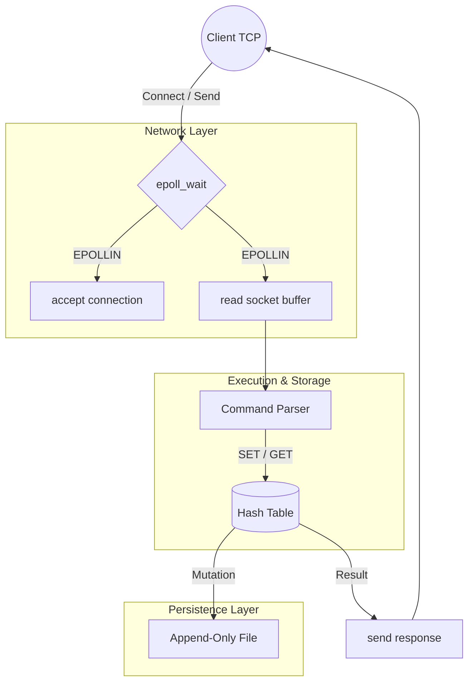

# C-dis: Multiplexed Key-Value Store

**A high-performance, single-threaded, in-memory database built from scratch in C99.**

C-dis is a lightweight systems engineering project designed to explore the low-level mechanics of network multiplexing and in-memory data storage. By bypassing multi-threaded locking overhead and utilizing an event-driven architecture via `epoll`, the system handles high-concurrency TCP connections on a single thread.

## Features
- Single-threaded epoll event loop — handles concurrent clients without threads
- Custom hash table — djb2 hashing, O(1) average lookup, separate chaining
- Write-ahead log persistence — survives kill -9, replays on restart
- 20,100 ops/sec on loopback — verified with custom C benchmark
- Zero memory leaks — verified with Valgrind across 40,000 operations

## System Architecture

The server architecture is decoupled into three primary subsystems: Network I/O, Data Storage, and Disk Persistence. 



### 1. Network Multiplexer (`server_epoll.c`)
Utilizes a single-threaded event loop backed by epoll. By leveraging level-triggered network notification, the server parks idle connections and instantly routes active socket file descriptors to the parser when data is present in the kernel buffer. This eliminates the massive context-switching overhead inherent in thread-per-client or select() based models.

### 2. Core Data Engine (`store.c`)
Data resides entirely in heap memory within a custom `HashTable` implementation. It provides `O(1)` average time complexity for lookups, resolving collisions via separate chaining (linked lists). Memory is strictly managed and verified leak-free.

### 3. Persistence Layer (`persist.c`)
To guarantee fault tolerance, state mutations are synchronously written to an Append-Only File (AOF) using POSIX file I/O. During the boot sequence, the main thread replays this log to reconstruct the exact database state prior to binding to the network interface.

---

## Performance Metrics

Benchmarked on local loopback (`127.0.0.1`) using a custom synchronous C testing suite (simulating continuous `SET`/`GET` pipelines). 

* **Throughput:** ~20,100 requests per second (RPS)
* **Execution Latency:** < 50 microseconds per round-trip operation
* **Memory Profiling:** 0 bytes leaked across 40,000 operations (Verified via `Valgrind --leak-check=full`)

Note: Throughput is currently bounded by synchronous AOF writes on 
each mutation and single-client loopback round-trip latency. 
Pipelining multiple commands per connection would significantly 
improve throughput under concurrent load.

---

## Build and Deployment

### Prerequisites
* GCC or Clang compiler
* Linux environment (Requires `epoll` kernel system calls)
* Strictly compiled against `-std=c99` with `-D_POSIX_C_SOURCE=200809L`

### Compilation
The project utilizes a standard `Makefile` for artifact generation.

```bash
# Compile the main database server
make

# Compile the benchmarking tool
make benchmark
```

### Execution
Start the daemon. By default, it binds to `0.0.0.0:6379`.

```bash
./kvstore
```

### Client Interaction
C-dis accepts standard raw TCP socket connections. 

```bash
$ nc localhost 6379
> SET root access_granted
+OK
> GET root
$access_granted
```

---

## Technical Limitations

* **Eviction Policies:** The current implementation lacks LRU (Least Recently Used) caching algorithms. Memory utilization is currently bounded only by hardware limits.
* **Network Pipelining:** The command parser requires upgrading to process large batched command buffers, reducing `recv()` syscall overhead under extreme loads.
