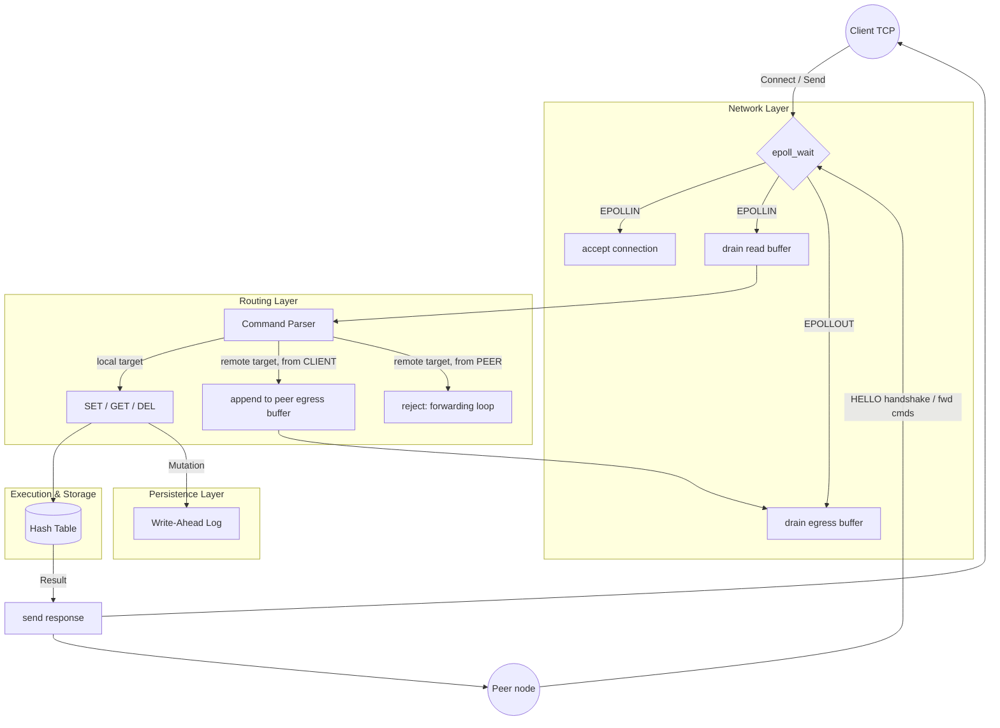

# C-dis: Distributed Key-Value Store
*C-dis (C + Redis) — a Redis-inspired key-value store built in C.*

**A high-performance, single-threaded, in-memory key-value store with a hash-based distributed routing mesh, built from scratch in C99.**

C-dis is a lightweight systems engineering project exploring the low-level mechanics of network multiplexing, in-memory storage, and peer-to-peer command routing. Each node is a single-threaded event-driven `epoll` server: no threads, no locks on the hot path — concurrency comes entirely from the kernel's socket buffers and a disciplined I/O design.

Nodes are orchestrated as a Kubernetes `StatefulSet` by a custom Go Operator that watches a `KVStore` CRD, provisions a Headless Service for stable DNS, mounts PVCs for the write-ahead log, and injects cluster topology via environment variables.

## Features

- Single-threaded edge-triggered `epoll` event loop — concurrent clients, peers, and health probes on one thread
- Custom hash table — O(1) average lookup, separate chaining
- Write-ahead log persistence — mutations are logged before execution; replayed on restart
- **Distributed routing** — commands hash to their owning node and are forwarded once over a persistent peer mesh (no per-command connections)
- **Traffic disambiguation** — in-band `HELLO` handshake identifies inbound peers; the forward-at-most-once invariant prevents forwarding loops
- **Non-blocking egress** — per-connection write buffers + `EPOLLOUT` draining; a slow peer can never stall the event loop
- **TCP stream discipline** — per-connection read buffers drain to `EAGAIN` (required under edge-triggered mode); fragmented/pipelined lines reassembled correctly
- **Graceful shutdown** — SIGTERM/SIGINT → stop intake → bounded peer drain → clean FINs → WAL `fsync`
- 20,100 ops/sec on loopback (standalone benchmark) — verified with custom C benchmark
- Zero memory leaks — verified with Valgrind across 40,000 operations

## System Architecture


```mermaid
graph TD
    Client((Client TCP)) -->|Connect / Send| Epoll{epoll_wait}
    Peer((Peer node)) -->|HELLO handshake / fwd cmds| Epoll

    subgraph "Network Layer"
        Epoll -->|EPOLLIN| Accept[accept connection]
        Epoll -->|EPOLLIN| Read[drain read buffer]
        Epoll -->|EPOLLOUT| Drain[drain egress buffer]
    end

    subgraph "Routing Layer"
        Read --> Parser[Command Parser]
        Parser -->|local target| Exec
        Parser -->|remote target, from CLIENT| Fwd[append to peer egress buffer]
        Parser -->|remote target, from PEER| Reject["reject: forwarding loop"]
        Fwd --> Drain
    end

    subgraph "Execution & Storage"
        Exec[SET / GET / DEL] --> HT[(Hash Table)]
    end

    subgraph "Persistence Layer"
        Exec -->|Mutation| AOF[Write-Ahead Log]
    end

    HT -->|Result| Resp[send response]
    Resp --> Client
    Resp --> Peer
```

### 1. Network Multiplexer (`server_epoll.c`)
Single-threaded event loop backed by edge-triggered epoll (`EPOLLET`). Idle connections park in the kernel; when data is available the fd is routed to the read path, which **must** drain to `EAGAIN` — under edge-triggered mode, bytes left in the kernel buffer never generate another event.

### 2. Distributed Router
The command parser hashes the key (djb2 `% cluster_size`) to an owning node. Routing decisions are enforced by a per-connection **role tag**:

| Origin | Target local | Target remote |
|---|---|---|
| `CLIENT` | execute locally | **forward once** to the peer's persistent socket |
| `PEER` | execute locally, reply on the peer socket | **reject** (`-ERR forwarding loop`) |

- **Peer registry:** `node_id → fd` (fixed array) plus reverse `fd → node_id` lookup, sized from `RLIMIT_NOFILE`. Registered when a non-blocking `connect()` completes (`EPOLLOUT` + `getsockopt(SO_ERROR)`); unregistered before `close()` on every disconnect path.
- **Inbound peer identity:** a peer that connects to *us* is anonymous at `accept()`. Its first line must be `HELLO <node_id>`; the node validates and promotes the connection from `UNKNOWN` to `PEER`. Anything else is treated as a client command.
- **Egress buffering:** forwarded commands are copied into a per-connection write buffer (4 KB, grows to 64 KB cap) and drained on `EPOLLOUT` — `write()` never blocks the loop.
- **Read buffering:** per-connection ingress buffer (4 KB → 256 KB cap) with a 4 KB per-line protocol limit; all complete lines are extracted per event.

### 3. Core Data Engine (`store.c`)
Data resides entirely in heap memory in a custom `HashTable`, O(1) average lookups via separate chaining.

### 4. Persistence Layer (`persist.c`)
Mutations are written to the write-ahead log (`/app/data/kvstore.log` on the Pod's PVC) **before** execution. On boot the log is replayed into the hash table before the network layer accepts traffic. Note: *locally executed* commands are durable; *forwarded* commands are at-most-once (they live in the egress buffer until drained — including a bounded ~2 s drain during shutdown). WAL replication of forwarded entries is on the future-work list.

---

## Kubernetes Deployment

A custom Go Operator watches the `KVStore` CRD and provisions:

- `StatefulSet` — one C-dis Pod per node, stable identity `kv-store-N`
- **Headless Service** — stable per-replica DNS (`kv-store-0.kv-store-network`, …)
- PVC mounted at `/app/data` — the write-ahead log survives reschedules
- Environment injection:
  - `CLUSTER_SIZE` — number of nodes (drives hash ring sizing)
  - `HOSTNAME` — parsed to this node's ID (`kv-store-N` → `N`)
  - `PEER_NODES` — comma-separated headless DNS names of all replicas

```bash
kubectl apply -f kv-store.yaml   # KVStore CR
kubectl get pods -w              # kv-store-0/1/2 …
kubectl port-forward pod/kv-store-0 6379:6379
```

---

## Performance Metrics

Benchmarked on local loopback (`127.0.0.1`) using a custom synchronous C testing suite (continuous `SET`/`GET` pipeline).

* **Throughput:** ~20,100 requests per second (RPS)
* **Execution latency:** < 50 µs per round-trip operation
* **Memory profiling:** 0 bytes leaked across 40,000 operations (`Valgrind --leak-check=full`)

Throughput is currently bounded by synchronous AOF writes on each mutation and loopback round-trip latency.

---

## Build and Deployment

### Prerequisites
* GCC or Clang
* Linux (requires `epoll`)
* Compiled with `-std=c99 -D_POSIX_C_SOURCE=200809L` (see `Makefile`)

### Compilation
```bash
make            # builds ./kvstore
make benchmark  # builds the benchmarking tool
make test       # hash table unit tests
```

### Local Execution
```bash
CLUSTER_SIZE=1 ./kvstore
# In a cluster the Operator sets CLUSTER_SIZE, HOSTNAME, PEER_NODES.
# Env vars can be exported manually for local multi-instance testing.
```

### Client Interaction
C-dis accepts raw TCP connections on `6379` (newline-terminated commands):

```bash
$ nc localhost 6379
> SET root access_granted
+OK
> GET root
$access_granted
```

---

## Future Work

Deliberately out of scope for the current release, documented as design intent:

* **Mesh healing** — background re-bootstrap of lost peer connections with exponential backoff (today a peer stays at `peer_sockets[N] == -1` until process restart; client commands targeting that node get `-ERR peer unreachable`).
* **Consistent hashing with virtual nodes** — the current `djb2 % cluster_size` ring reshapes the entire keyspace on any membership change; virtual-node rings would limit migration to ~1/N of keys.
* **Resharding / key migration protocol** — moving key ownership between nodes requires a migration handshake (snapshots, in-flight filtering, cutover); today scaling `CLUSTER_SIZE` changes the hash function retroactively.
* **Readiness probe** — report "ready" only after WAL replay *and* a quorum of peer connections is established, so k8s can gate traffic on cluster health rather than port liveness alone.
* **Durable forwarding** — replicate WAL entries to peers so forwarded commands become at-least-once instead of at-most-once.
* **Peer authentication** — TLS/mTLS or token-based HELLO for multi-tenant or multi-cluster meshes.
* **Eviction policies** — LRU / max-memory limits (currently unbounded).

## Technical Limitations

* **Forwarding is single-hop, at-most-once** — a forwarded command in a full egress buffer, or lost at shutdown after drain timeout, is not retried.
* **No eviction** — memory bounded only by hardware.
* **Static topology** — cluster membership is fixed at boot via `PEER_NODES`; no dynamic join/leave.
